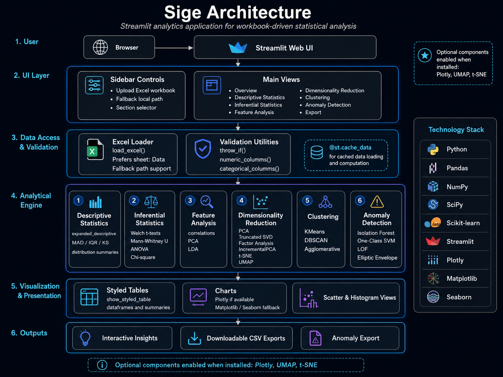

___

## 🧭 Purpose

This page describes the runtime structure of the Sige python application. The application is organized as a single-page analytical workflow with source-level utility functions supporting data loading, statistical analysis, visualization, machine learning projections, clustering, anomaly detection, and export.

## 🧱 Application Layers

| Layer                          | Responsibility                                                                                                    | Source Elements                                                                                |
|--------------------------------|-------------------------------------------------------------------------------------------------------------------|------------------------------------------------------------------------------------------------|
| Presentation layer             | Configures the Streamlit page, logo, sidebar, section selector, controls, tables, plots, captions, and downloads. | `st.set_page_config`, `st.logo`, sidebar controls, section router                              |
| Data input layer               | Loads an uploaded Excel workbook or fallback workbook path.                                                       | `load_excel`                                                                                   |
| Data inspection layer          | Identifies numeric and categorical columns and renders summary tables.                                            | `numeric_columns`, `categorical_columns`, Overview section                                     |
| Descriptive statistics layer   | Computes expanded descriptive statistics and distribution insights.                                               | `expanded_descriptive`, `safe_mad`, `histogram_with_insight`                                   |
| Inferential statistics layer   | Runs group, distribution, and categorical tests.                                                                  | `pairwise_ttests`, `anova_test`, `chi2_categorical`                                            |
| Feature-analysis layer         | Computes correlations, PCA projections, LDA projections, and optional k-means summaries.                          | Feature Analysis section, `compute_pca`, `run_clustering`                                      |
| Dimensionality-reduction layer | Projects numeric features into lower-dimensional spaces.                                                          | `compute_pca`, `compute_truncated_svd`, `compute_factor_analysis`, IncrementalPCA, t-SNE, UMAP |
| Clustering layer               | Assigns cluster labels and summarizes group membership.                                                           | `run_clustering`                                                                               |
| Anomaly-detection layer        | Flags outlier records with selected detectors.                                                                    | `detect_anomalies`                                                                             |
| Export layer                   | Produces downloadable CSV outputs.                                                                                | `st.download_button`                                                                           |

## 📥 Data Flow

```text
Excel upload or fallback path
        ↓
load_excel
        ↓
pandas DataFrame
        ↓
Column detection and data validation
        ↓
Sidebar-selected analytical section
        ↓
Tables, charts, model outputs, anomaly records, and CSV exports
```

## 🧮 Analytical Utilities

| Utility                | Purpose                                                                                      |
|------------------------|----------------------------------------------------------------------------------------------|
| `throw_if`             | Validates mandatory arguments before selected analytical operations run.                     |
| `fmt_num`              | Formats numbers for readable display.                                                        |
| `numeric_columns`      | Returns numeric, non-boolean columns.                                                        |
| `categorical_columns`  | Returns object and category columns.                                                         |
| `safe_mad`             | Computes median absolute deviation with a fallback independent of SciPy version differences. |
| `expanded_descriptive` | Builds a descriptive statistics table across selected numeric columns.                       |
| `style_dataframe`      | Applies numeric formatting to a DataFrame copy.                                              |
| `show_styled_table`    | Renders a styled Streamlit table with optional height control.                               |

## 🧪 Modeling and Detection Components

| Component                 | Algorithms                                                         |
|---------------------------|--------------------------------------------------------------------|
| Dimensionality reduction  | PCA, TruncatedSVD, FactorAnalysis, IncrementalPCA, t-SNE, UMAP     |
| Clustering                | KMeans, DBSCAN, AgglomerativeClustering                            |
| Anomaly detection         | IsolationForest, OneClassSVM, LocalOutlierFactor, EllipticEnvelope |
| Classification projection | LinearDiscriminantAnalysis                                         |

## 📊 Visualization Strategy

Sige prefers Plotly when available. If Plotly is unavailable, the application falls back to Matplotlib and Seaborn where applicable. This preserves interactive charts on fully installed systems while keeping the application usable in lighter Python environments.

## 📤 Output Strategy

The application produces browser-rendered outputs through Streamlit tables and charts. Exportable files are generated through Streamlit download buttons as UTF-8 encoded CSV content.

## 🧭 Architecture Summary

Sigefollows a conventional analyst-workbench pattern: load data, inspect structure, select analytical workflow, compute results on demand, visualize outputs, and export records requiring follow-up. The source is centralized in `app.py`, which simplifies deployment but makes docstring quality and source-level API documentation especially important.
