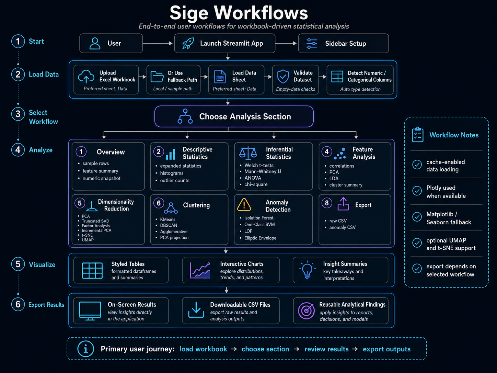

___

## 🧭 Purpose

This page maps the Schedule-X sidebar sections to their analytical purpose, user inputs, computations, and outputs.

## 🧱 Workflow Sequence

```text
Load Data
   ↓
Overview
   ↓
Descriptive Statistics
   ↓
Inferential Statistics
   ↓
Feature Analysis
   ↓
Dimensionality Reduction
   ↓
Clustering
   ↓
Anomaly Detection
   ↓
Export
```

## 📊 Workflow Summary

| Workflow                 | Primary Inputs                                   | Main Computations                                                                                      | Outputs                                                                  |
|--------------------------|--------------------------------------------------|--------------------------------------------------------------------------------------------------------|--------------------------------------------------------------------------|
| Overview                 | Loaded DataFrame                                 | Head sample, dtypes, unique counts, missing counts, numeric describe table                             | Data sample, feature summary, numeric snapshot                           |
| Descriptive Statistics   | Numeric columns                                  | Mean, median, standard deviation, MAD, CV, skewness, kurtosis, IQR, quantiles, outlier counts, KS test | Expanded statistics table and distribution plots                         |
| Inferential Statistics   | Numeric and categorical columns                  | Welch t-test, Mann-Whitney U, ANOVA, chi-square                                                        | Test statistics, p-values, contingency tables                            |
| Feature Analysis         | Numeric features and optional categorical target | Correlation matrix, PCA, LDA, optional k-means                                                         | Correlation table, variance chart, projections, cluster summary          |
| Dimensionality Reduction | Numeric features and selected method             | PCA, SVD, FactorAnalysis, IncrementalPCA, t-SNE, UMAP                                                  | Two-dimensional projection charts and explained variance where available |
| Clustering               | Numeric features and clustering algorithm        | KMeans, DBSCAN, AgglomerativeClustering                                                                | Cluster labels, counts, PCA visualization, silhouette score when valid   |
| Anomaly Detection        | Numeric features and detector settings           | Isolation Forest, One-Class SVM, LOF, Elliptic Envelope                                                | Outlier records and anomaly CSV download                                 |
| Export                   | Loaded DataFrame or anomaly results              | CSV serialization                                                                                      | Downloadable CSV files                                                   |

## ✅ Recommended Operating Pattern

1. Start with Overview to verify the data loaded correctly.
2. Use Descriptive Statistics to assess scale, spread, skewness, and missing values.
3. Use Inferential Statistics only after selecting meaningful comparison columns and grouping fields.
4. Use Feature Analysis to identify correlation patterns and dimensional structure.
5. Use Dimensionality Reduction to compare projections and inspect latent structure.
6. Use Clustering to identify potential groups of similar records.
7. Use Anomaly Detection to identify records requiring analyst follow-up.
8. Use Export to preserve the records needed outside the Streamlit session.

## ⚠️ Interpretation Rules

| Rule                                                                | Rationale                                                                                              |
|---------------------------------------------------------------------|--------------------------------------------------------------------------------------------------------|
| Treat statistical significance as a signal, not a final conclusion. | Budget data often violates distributional assumptions.                                                 |
| Inspect missing values before comparing models.                     | Different workflows may operate on different retained rows after coercion and dropping missing values. |
| Review categorical fields before grouping.                          | Account codes and identifiers may look numeric but behave categorically.                               |
| Use multiple anomaly methods for sensitive reviews.                 | Each detector encodes different assumptions about outliers.                                            |
| Export and preserve parameters used for review.                     | Reproducibility requires knowing selected columns and detector settings.                               |
